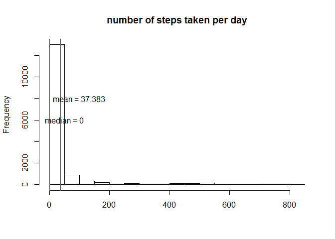
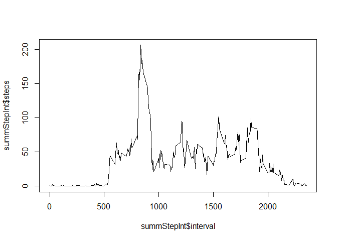
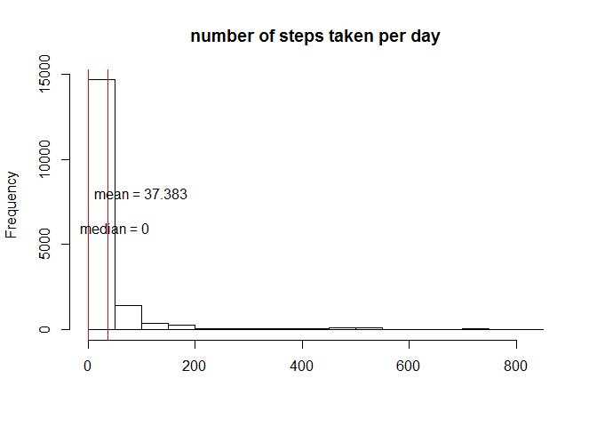
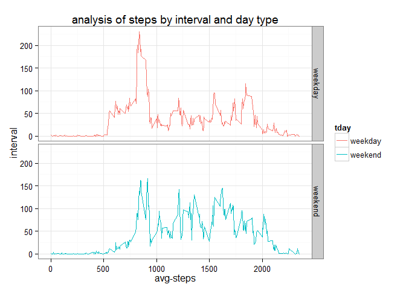
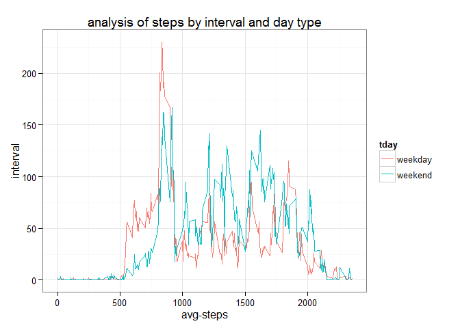

# Reproducible Research: Peer Assessment 1

### Analysis of steps taken  


```r
library(knitr)
```

```
## Warning: package 'knitr' was built under R version 3.1.1
```

```r
dd <- read.csv("activity.csv")
kable(summary(dd))
```


|   |    steps       |        date       |   interval    |
|:--|:---------------|:------------------|:--------------|
|   |Min.   :  0.0   |2012-10-01:  288   |Min.   :   0   |
|   |1st Qu.:  0.0   |2012-10-02:  288   |1st Qu.: 589   |
|   |Median :  0.0   |2012-10-03:  288   |Median :1178   |
|   |Mean   : 37.4   |2012-10-04:  288   |Mean   :1178   |
|   |3rd Qu.: 12.0   |2012-10-05:  288   |3rd Qu.:1766   |
|   |Max.   :806.0   |2012-10-06:  288   |Max.   :2355   |
|   |NA's   :2304    |(Other)   :15840   |NA             |

```r
dd <- dd[!is.na(dd$steps),]

hist(dd$steps,main="number of steps taken per day",xlab="")
abline(v=mean(dd$steps),col="red")
abline(v=median(dd$steps),col="red")
text(x = 50, y=6000,paste("median =",round(median(dd$steps),3)))
text(x = 100, y=8000,paste("mean =",round(mean(dd$steps),3)))
```

 

### Analysis of daily activity pattern  


```r
summStepInt <- aggregate(dd$steps, by=list(dd$interval), mean)
names(summStepInt) <- c("interval","steps")
plot(summStepInt$steps~summStepInt$interval, type="l")
```

 

```r
maxSteps <- head(summStepInt[order(summStepInt$steps,decreasing = T),],1)
```

The interval with most steps on average is # 835 with an average of 206.1698 steps  

### Input of missing values  


```r
dd <- read.csv("activity.csv")
dd <- merge(dd, summStepInt, by="interval")
dd$steps.x[is.na(dd$steps.x)] <- dd$steps.y[is.na(dd$steps.x)]
dd <- dd[,c(1:3)]
names(dd)[2] <- "steps"
kable(summary(dd))
```


|   |   interval    |    steps       |        date       |
|:--|:--------------|:---------------|:------------------|
|   |Min.   :   0   |Min.   :  0.0   |2012-10-01:  288   |
|   |1st Qu.: 589   |1st Qu.:  0.0   |2012-10-02:  288   |
|   |Median :1178   |Median :  0.0   |2012-10-03:  288   |
|   |Mean   :1178   |Mean   : 37.4   |2012-10-04:  288   |
|   |3rd Qu.:1766   |3rd Qu.: 27.0   |2012-10-05:  288   |
|   |Max.   :2355   |Max.   :806.0   |2012-10-06:  288   |
|   |NA             |NA              |(Other)   :15840   |

```r
hist(dd$steps,main="number of steps taken per day",xlab="")
abline(v=mean(dd$steps),col="red")
abline(v=median(dd$steps),col="red")
text(x = 50, y=6000,paste("median =",round(median(dd$steps),3)))
text(x = 100, y=8000,paste("mean =",round(mean(dd$steps),3)))
```

 

The impact of imputing missing values is virtually zero

### Weekdays X weekends  


```r
dd$tDay <- "weekday"
dd$tDay[weekdays(as.Date(dd$date)) %in% c("Saturday", "Sunday")] <- "weekend"
dd$tDay <- factor(dd$tDay)

summStepInt <- aggregate(dd$steps, by=list(dd$interval, dd$tDay), mean)
names(summStepInt) <- c("interval", "tday","steps")

library(ggplot2)
```

```
## Warning: package 'ggplot2' was built under R version 3.1.1
```

```r
plot(ggplot(summStepInt, aes(interval,steps,colour=tday)) 
  + geom_line() 
  + facet_grid(tday ~ .)
  + theme_bw() + ggtitle("analysis of steps by interval and day type") 
  + ylab("interval") + xlab("avg-steps"))
```

 

```r
plot(ggplot(summStepInt, aes(interval,steps,colour=tday)) 
  + geom_line() 
#   + facet_grid(tday ~ .)
  + theme_bw() + ggtitle("analysis of steps by interval and day type") 
  + ylab("interval") + xlab("avg-steps"))
```

 

It seems that on weekends people tend to wake up later and distribute their activity better through the day.  

